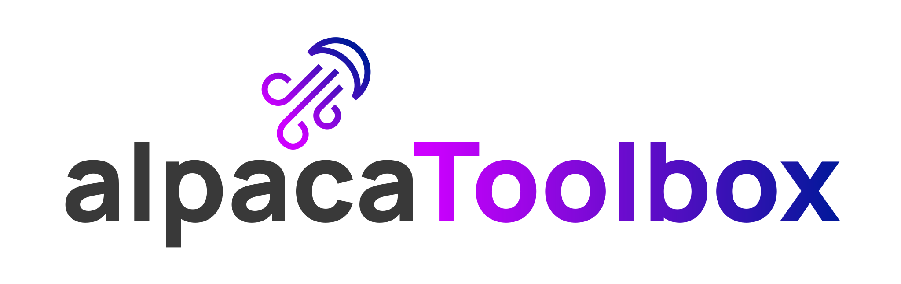

<h1 align="center">
  <br>
  
  <br>
  Alpaca
  <br>
</h1>

<h4 align="center">A complete GUI server for OpenFujin made in Vue</h4>

<p align="center">


</p>

## Project setup
```
npm install
```

### Compiles and hot-reloads for development
```
npm run serve
```

### Compiles and minifies for production
```
npm run build
```

### Lints and fixes files
```
npm run lint
```

### Customize configuration
See [Configuration Reference](https://cli.vuejs.org/config/).
